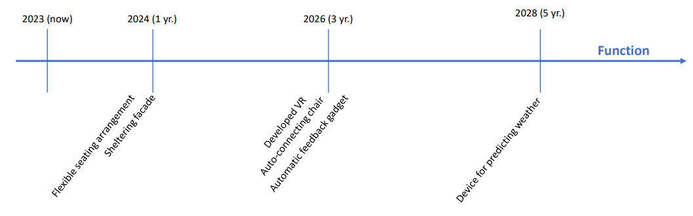

# A2 Needs

## 2.1 Identify Future Gaps
#### Future gaps and new inventions
H1: To make intimate concerts easier for the performer a device that does not exist today could be a seat/chair which automatically connects with any instrument/microphone and connects to the pavilion’s speaker system. To provide a variety of intimate experiences at the pavilion a VR-system could also be integrated in a safe way. This will benefit from further technological development to improve resistance to weather, quality, immersiveness, etc. \
H2: To make the automatic feedback systems efficient and unnoticeable by the users of the pavilion it must be able to track how people react on and around the pavilion. A gadget that can do this easily and affordable must be invented. Furthermore, advanced data analytics tools could be used to process this feedback and provide organizers with actionable insights in real-time, allowing for quick adjustments to improve the festival experience. \
H3: A technology that can provide weather data quickly and precisely from the location of the pavilion. This device must be affordable and able to handle the weather. Weather monitoring sensors and forecasting technology could be integrated into the pavilion's infrastructure to provide real-time weather updates. Automated alert systems can notify attendees of potential weather-related risks, such as storms, and advise on necessary precautions or shelter locations.
#### The effect of the gaps on the gene systems
The function of the pavilion will be directly affected by the gaps presented in H1 and H2 due to these directly creating gaps for the function of the pavilion. Both regarding the accommodation of different performers and integrating intuitive feedback methods for the users of the pavilion. 
For H3 the assembly of the pavilion as well as the material used for the implemented weather apps or automated systems to predict the weather conditions need to be considered. The pavilion should still be easy to assemble, and the materials need to be within a certain budget as well as being sustainable.

## 2.2 System Requirements
#### Function
The function of the pavilion, accommodating small performers, will affect the environment around the pavilion in a way that will hopefully attract more people to the pavilion, making the area around the pavilion a gathering area. This will create a requirement for the area around it to be able to accommodate a larger number of people. The pavilion will need to be able to turn from a performing stage to a relaxing area rather easily. This affects several systems of the pavilion.
This function requirement changes with the future as we go further into the future and new technology for feedback and weather prediction will be developed. They will change from simple form and accommodation requirements to technological requirements for new systems.

#### Build
The assembly of the pavilion should be simple however it still needs to accommodate the different needs of the function of the pavilion. The assembly of the pavilion will require power for several of the functions of the pavilion which will require the environment around the pavilion to be able to provide this power without being a hindrance to the festivalgoers.
As new technology gets developed the building process of the pavilion will change to integrate and make use of the new technology in the platform.

#### Material
The materials needed for the system won’t affect the surrounding environment, however, the power needed will be seen as a resource that will affect the environment by creating new requirements for the environment.
The materials for the pavilion could change when the integration of new technology for weather prediction emerges. Thus, the requirements for the materials used for the pavilion will change.

## 2.3 System Features
#### Function
The pavilion could have a feature integrated into the façade that would allow it to be closed but with a hinge that could tilt upwards (to become an overhang) to provide cover for an exterior area of the pavilion providing shelter from rain for people standing outside. 
Another feature could be flexible seating arrangements to easily accommodate different types of small performances/events/experiences.
Several other features are already mentioned in “2.1 Identify Future Gaps”. \

Features regarding the function that can be developed early are the seating arrangement and the sheltering façade as it does not depend on new inventions. VR, the chair and the feedback gadget require technological development and are therefore not realistic until 2026. The feedback gadget is quite complicated and will maybe take longer, but that is uncertain. If it is not ready for 2026 feedback can be gathered through a mobile application. The device for predicting the weather, warning people and informing them of shelter is quite complicated and will most likely need at least 5 years.
#### Build
The build gene system will have elements that are premade and easy to assemble. This could be wooden beams and columns that are cut with joints and predrilled holes for bolts to be easily tightened. This feature will ensure easy assembly. The use of simple columns to support the overhang when the façade elements are tilted outwards will need to be established.

 
Features related to the building-gene are all ready for 2024.
#### Material
The features of the materials used for the product need to be recyclable and durable for use over several times. This will specifically be a challenge for the technological aspects of the pavilion that are to be implemented in H2 or H3.  \
The features of the materials will be developed along the components used to satisfy the function and the build gene systems and will thus be developed along the others and their timelines.

## 2.4 System Examples
#### Function
The automatically connecting chair/seat is supposed to work with a sensor (To detect a performer in the seat) and Bluetooth (To connect with the instrument). Like a mobile charger station and Bluetooth speakers and would probably be a synthetization into this hybrid solution.
Virtual Reality (VR) today requires a mask, a lot of space and is expensive. Further development would be needed to make the use of VR less spacious and more affordable. \
If VR develops masks that are smaller like glasses and less expensive it would greatly improve the realistic perspective of this idea without using too much of the pavilion’s budget. \
The automatic feedback gadget is believed to be a mix of motion sensors/cameras and machine learning which synthesizes into a hybrid product that can efficiently notice if peoples’ behavior at the pavilion indicates if it performs well or badly.
The weather gadget could be a product with roots in GPS and weather forecasting apps, but must be very precise and that is most likely the biggest challenge for this future solution. \
To advise people of safe shelter during a storm a device that can scan the festival area quickly for safe areas must be invented and will most likely have roots in satellite pictures and/or drone pictures. \
To provide the correct shelter which is simple and adjustable it must be a mix of an awning and a gate/lid to create the facades that can also be used as shelter.
#### Build:
To support the overhang of the building simple tentpoles can be set up much like a traditional tent that has a front tent with an overhang or a flip-up table that has the supports implemented these will drop down when the façade elements are flipped out. 
#### Materials
The materials need to be cheap and durable which could be a form of CLT wood for the columns. They would need to be impregnated to be durable and water resistant. The façade can be made up of several different elements much like current recyclable facades, from all different kinds of stuff found at e.g., a recycling plant. This will give the pavilion a clear sustainable “look” to people passing by.

## 2.5 System Analysis
#### Function
The applicability of the pavilion would need to be tested by different performers with different needs to ensure that all performers have an easy way to set up using the features of the pavilion. This could ensure that the auto-connecting chair could connect to all the different instruments that the performers would bring for the performances. 
Testing of the sheltering façade could be done by seeing if a model of the pavilion with the overhang out could withstand wind from a tunnel and direct the water from rain away from the area where the performer would stand under the overhang.
For weather-predicting software, machine learning algorithms can be used to test the precision and reliability of the results. This can be integrated as datasets into courses at DTU such as “Introduction to Machine Learning and Data Mining”.

#### Build
The components for the assembly of the pavilion can be made in a factory or at DTU where the ability to assemble the pavilion easily and the different structural elements could be tested beforehand to ensure that students would be able to assemble it at the site. Here the easiest manufacturing ways of the materials can also be tested, and the production of the materials can be integrated into courses at DTU.

#### Material
The materials should be tested for durability and weather protection by being exposed to similar weather and load bearings conditions as would happen at the Roskilde Festival. 

## 2.6 Future Case
Title: A Stormy Day at Roskilde Festival \
Character: Karen, a 28-year-old festival enthusiast \
It is the summer of 2028 as the clouds gather over the Roskilde Festival grounds, Karen checks her festival app on her phone. The weather forecast is grim—heavy rain and possible thunderstorms for the day. Despite the weather, she's excited about today's performances at the Pavilion, known for its adaptability to unpredictable conditions. \
Karen heads to the pavilion from DTU she has heard so much about. Along the way, she notices a weather prediction device stationed near the festival entrance. It is a part of the pavilion from DTU and serves to inform people at the entrance. It provides real-time updates and advises attendees on which areas to avoid due to potential storm hazards. Karen makes a mental note of it as she proceeds, but also remembers that here festival app contains the same information.
Arriving at the pavilion, Karen marvels at its transformation since her last visit. The pavilion's façade has been updated with a unique feature—a hinged overhang. Even with the pouring rain, festivalgoers gather beneath the sheltered area, enjoying performances and staying dry. Karen takes advantage of this innovative shelter as she waits for her friends to arrive. \
Inside the pavilion, Karen finds a comfortable spot on a self-adjusting seat. Some seats are equipped with automatic instrument-microphone connectors, making it easy for performers to set up quickly. Karen watches as a familiar face seamlessly connects their guitar to the seat's built-in system, eliminating the need for extensive soundchecks. He starts playing a slow song and people quiet down and listen. The performance is unique and intimate as it is not part of the festival’s concert program. Karen finally recognizes him as she has seen him on posters for the festival and realizes he has a concert later that day. Karen thinks to herself that he is warming up and connecting with people before his own concert. \
During the performance, Karen notices small motion sensors integrated into the pavilion's architecture. These sensors capture the audience's reactions and body language, contributing to real-time feedback for the performers. The automatic feedback gadget is unobtrusive, allowing Karen to focus on the music while still providing valuable input for the people responsible for the pavilion. \
As the concert progresses, Karen receives an alert on her phone. The weather prediction device she saw earlier has detected a nearby lightning strike. The festival's automated alert system advises everyone to take shelter immediately. The pavilion's sheltered overhang quickly becomes a safe haven for festival-goers as the storm intensifies. \
Inside the pavilion, Karen feels safe and dry, thanks to the pavilion's innovative features. The automated weather monitoring system provides regular updates on the storm's progress and estimates when it will be safe to leave. Meanwhile, the pavilion's integrated virtual reality system allows attendees to immerse themselves in interactive experiences, keeping spirits high despite the gloomy weather.

