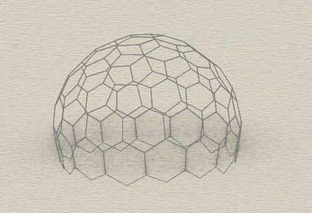
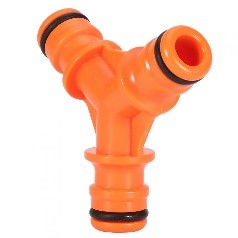

# A3 Analyze
**Team members:** \
Magnus Rathenborg s193950 \
Lucas Baun Dantzer s193934 \
 

**Problem:** Designing an Easy-to-Assemble Honeycomb Pavilion for the Roskilde Festival. \
**Prototype:** Roskilde Festival Honeycomb Pavilion \
**Pseudo Developmental Features and Stages for Roskilde Festival Honeycomb Pavilion:** \
**Stage 1 - Conception (Festival Pavilion Design):** \
•	Students at DTU conceive the idea of a honeycomb-inspired pavilion to serve as a gathering and performance space. \
•	The design blueprint includes easy assembly features and considerations for festival needs. \
•	The design blueprint outlines the pavilion's shape, size, and honeycomb arrangement. \
**Stage 2 - Embryonic Growth (Material Selection):** \
•	Selection of lightweight, strong, and portable materials suitable for easy assembly. \
•	Honeycomb structure of e.g., bamboo tubes. \
•	Materials are chosen for their durability and environmental friendliness. \
•	Materials undergo fabrication, influenced by structural and aesthetic requirements. \
**Stage 3 - Fetal Development (Component Formation):** \
•	Components for the festival pavilion are manufactured and designed for quick and easy assembly. \
•	Materials are formed and shaped at DTU for easy assembly on site. \
•	The genetic blueprint dictates the precise shaping and interlocking mechanisms of honeycomb-inspired components. \
•	This could be 3D-printed 3-way connectors such as simple ones for garden hoses (enlarged). \
  \
**Stage 4 - Birth (On-Site Assembly and Testing):** \
•	Festival attendees, with the help of a small team of technicians, assemble the pavilion on-site using minimal tools. \
•	Rigorous testing ensures that assembly is straightforward and safe. \
•	Genes controlling component arrangement to ensure it aligns with the architectural design. \
**Stage 5 - Adolescence (Adaptation to Festival Needs):** \
•	The honeycomb pavilion stands for a period, exposed to environmental factors. \
•	The pavilion accommodates the specific needs of the Roskilde Festival, such as providing shade, seating, and a stage for performances. \
•	The honeycomb façade can be filled with canvases with logos or messages for the attendees. \
•	Genes metaphorically represent the adaptation of the pavilion to the festival environment and usage patterns. \
•	Ongoing adjustments to optimize the pavilion for different festival activities. \
•	The canvases can easily be swapped out and replaced for different uses. \
**Stage 6 - Adulthood (Maturation):** \
•	The pavilion becomes a staple at the Roskilde Festival, known for its easy assembly and versatile functionality. \
•	Genes continue to influence the pavilion's ageing process, contributing to long-term durability. \
•	The pavilion may develop a unique festival patina and aesthetic characteristics. \
**Stage 7 - Reproduction (Design Knowledge Transfer):** \
•	Festival organizers and students share their knowledge of designing and assembling honeycomb festival pavilions with future festival teams. \
•	Genes symbolize the collective wisdom and expertise inherited by successive generations of festival organizers and students. \
**Stage 8 - Legacy (Cultural Significance at Roskilde Festival):** \
•	The pavilion becomes an integral part of the Roskilde Festival experience, serving as a symbol of innovation and community. \
•	Genes represent the cultural significance and historical value of the pavilion within the festival's history. \
**Features of Roskilde Festival Honeycomb Pavilion:** 
1.	Easy-to-assemble honeycomb-inspired components. 
2.	Versatile design accommodating festival needs (shade, seating, stage). 
3.	Lightweight, strong, and portable for transportation. 
4.	Environmentally friendly materials. 
5.	Durability and adaptability to festival conditions. 

**Reverse-engineering:** \
•	To understand where the honeycomb structure derives from, we need to look at the behaviour of bees as this is where the inspiration comes from. Bees instinctively build honeycombs in a hexagonal grid pattern. Genetic predisposition and evolution have shaped the instincts of bees to build efficient comb construction. Hexagons are mathematically efficient shapes that maximize storage space and minimize materials. Evolutionary pressures favor bees that construct combs with maximum storage capacity. \
•	Versatile design for festivals is especially affected by weather, accommodation needs and sizing. All these are parameters that change and therefore the pavilion meets these requirements. This is done by modularity and moveable seating and shading options. \
•	Goes hand in hand with the previously mentioned requirement and can be accomplished by using lightweight materials that are strong for a light structure. Transportable is met by being able to dismantle the pavilion. \
•	To meet the modern requirements associated with the climate crisis. Reusable materials that last long. Dismantling is important for this as well so not everything has to be changed if some parts are destroyed or used up. \
•	Weather and people at festivals can be rough at the pavilion so it needs to be sturdy materials. An example could be wood.
How Far Back in Time (Twice as Far as Forecast): If we forecasted the development of the Roskilde Festival Honeycomb Pavilion to 5 years in the future (2028), we would go back to 2013 when the Roskilde Festival began embracing innovative pavilion designs and sustainability practices, eventually leading to the creation of such a pavilion that seamlessly blends functionality, aesthetics, and easy assembly for festivalgoers.
By applying this pseudo-developmental model, the pavilion can be designed and adapted to meet the unique needs of the Roskilde Festival while offering festival attendees a user-friendly, eco-friendly, and culturally significant space for their enjoyment.

