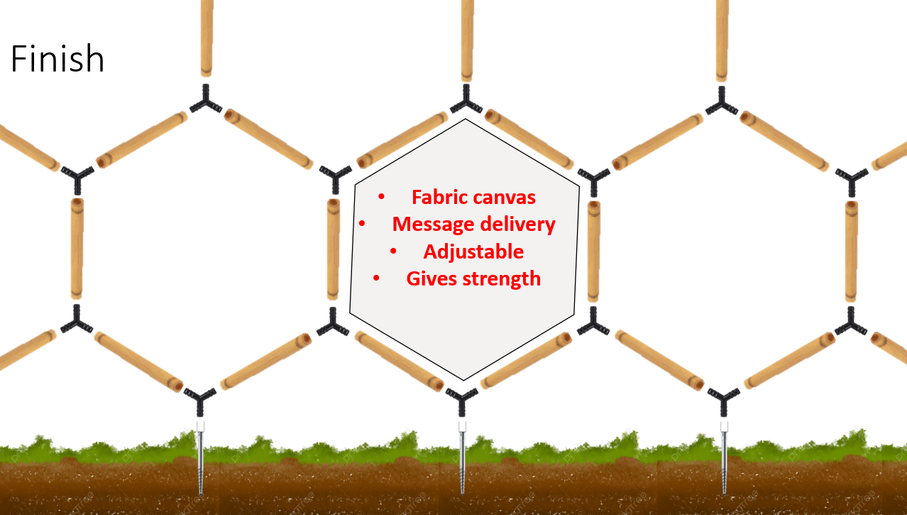

# A4 - Change

**Team members:** \
Magnus Rathenborg s193950 \
Lucas Baun Dantzer s193934 \

## User interactions and feature expression
The first user to interact with our pavilion will be the team that needs to package the pavilion in the container as well as the team assembling the pavilion on site. Our pavilion is made to be easy to assemble, the hardest part comes from drilling ground plugs into the ground which will be the basis of the pavilion that will support the entire structure. On top of the ground plugs, three-way connectors with rubber rings will be mounted and on these three-way connectors, the bamboo pipes can be inserted. The ground plugs and bamboo pipes are meant to be bought from a hardware store whereas the three-way connectors are meant to be 3D printed at DTU to fit the sizes of the bamboo pipes and have the correct angles. \
When the pavilion is assembled with the structural parts fabric canvases can be fitted inside the hexagonal shapes of the pavilion to provide shade, but these can also be decorated with logos or messages that the pavilion wishes to communicate to people passing by and users. This will add to our feature of getting feedback from the users through some of the messages printed on the canvases. \
When using the honeycomb structure, a rather large structure can be created since the individual elements of the bamboo pipes won’t be too long to fit inside the container. Thus, the pavilion can be adjusted in size to fit different purposes from small concerts to a more intimate smaller function. \

 \
A picture depicting the materials needed for construction and how they are connected. We see ground plugs in the ground, three-way connectors between the bamboo pipes, and a canvas in the middle for delivering messages or presenting the DTU logo. \
